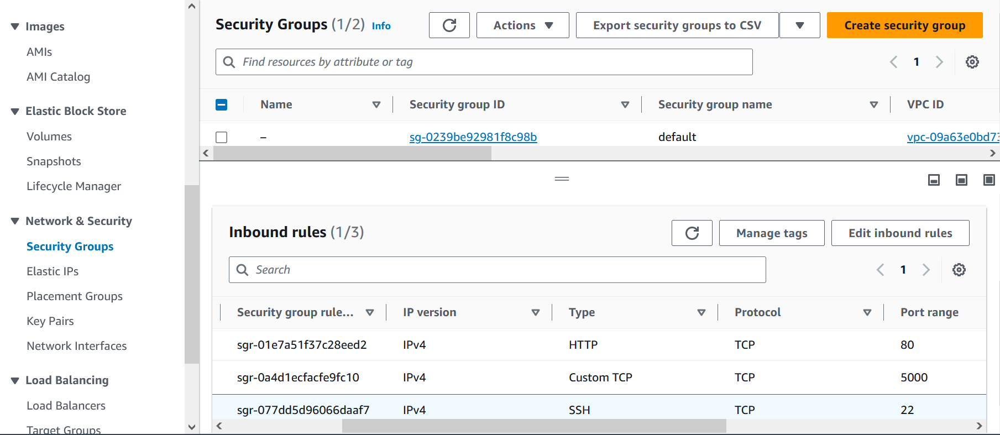

# Projet Flask déployé sur une instance EC2 avec Load Balancer, Auto Scaling et autres ressources AWS


Ce projet consiste à déployer une application Flask sur une instance EC2 d'Amazon Web Services (AWS) en utilisant un Load Balancer, l'Auto Scaling et d'autres ressources pour assurer la haute disponibilité et la mise à l'échelle automatique de l'application.

## Étapes de déploiement

1. Créer une instance EC2 :
   - Lancer une instance EC2 en utilisant une image Amazon Linux.
   - Configurer les groupes de sécurité pour permettre l'accès au port 80 (HTTP), au port 5000 (utilisé par votre application Flask) et au port 22 (utilisé pour SSH), depuis n'importe quelle adresse IP.
   
   - Utiliser le script `user-data` suivant pour la configuration initiale de l'instance :

```bash
    #!/bin/bash
    sudo yum update -y
    sudo yum install git -y
    sudo yum install httpd
    cd /var/www/
    sudo git clone https://github.com/AWS-Re-Start-RDC-KINSHASA-1/tp-1-barakael-henock.git
    sudo pip3 install Flask
    cd tp-1-barakael-henock/
    sudo chown -R ec2-user:ec2-user .
    chmod u+w .
    nohup flask run --host=0.0.0.0 --port=5000 > flask.log 2>&1 &
```

2. Configurer le Load Balancer :

Créer un Load Balancer de type Application Load Balancer (ALB) dans la même région AWS.
Configurer le Load Balancer pour écouter le trafic HTTP sur le port 80 et rediriger le trafic vers les instances EC2 créées précédemment.
Configurer les règles de santé du Load Balancer pour vérifier l'état de santé des instances EC2.

3. Configurer le Target Group :

Créer un Target Group associé au Load Balancer pour les instances EC2.
Configurer le Target Group pour rediriger le trafic vers les instances EC2 en utilisant le port 5000.

4. Configurer l'Auto Scaling :

Créer une configuration d'Auto Scaling en spécifiant le Target Group créé précédemment.
Configurer les règles d'échelle automatique en fonction de la charge de l'application.
Configurer les seuils de déclenchement pour augmenter ou diminuer le nombre d'instances EC2 en fonction de la charge.

5. Configurer le Launch Template :

Créer un Launch Template pour spécifier la configuration des instances EC2.
Inclure le script user-data dans le Launch Template pour automatiser la configuration initiale des instances EC2.

6. Tester l'application :

Accéder à l'URL du Load Balancer (http://flask-load-balancer-1650147702.us-east-1.elb.amazonaws.com/) pour tester l'application Flask déployée.
Vérifier que le trafic est réparti entre les instances EC2 et que l'Auto Scaling fonctionne correctement en ajoutant ou supprimant des instances en fonction de la charge.